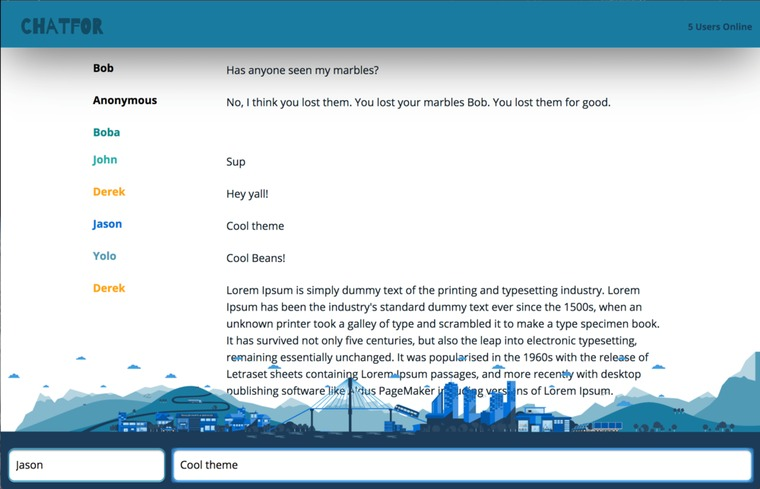

Chat App
=====================

Project from lighthouse-labs

A real-time chat application built on React, Node, Express and using websockets.

Improvised a theme around a found image. Will replace with stock photo soon.

### Get started

clone repo
Install the node dependencies and start the server.

### Dependencies

* React
* Webpack
* [babel-loader](https://github.com/babel/babel-loader)
* [webpack-dev-server](https://github.com/webpack/webpack-dev-server)
